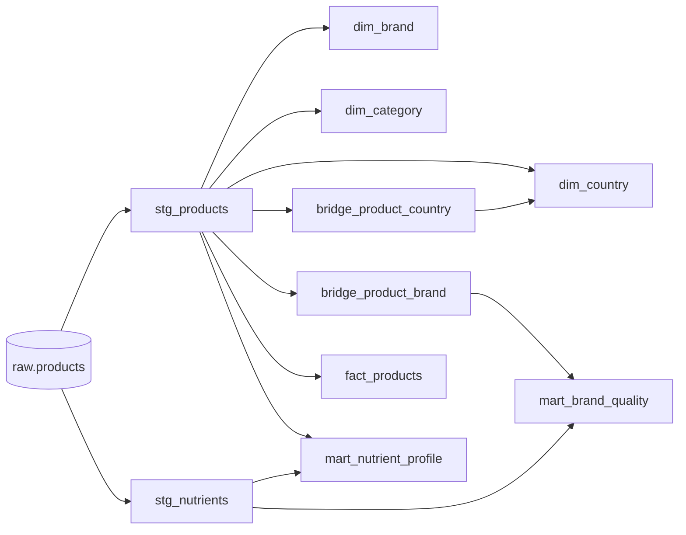

# 🍎 Food Data Lakehouse Platform

An end-to-end data engineering project built on top of the **Open Food Facts API**, simulating a real company data platform.

---

## 📌 Overview

This project ingests, cleans, models and visualizes food product data from the Open Food Facts API. It covers the full data engineering lifecycle, from raw ingestion to an interactive analytics dashboard.

---

## 🏗️ Architecture

```
Open Food Facts API
        ↓
[Python Ingestion Script]
        ↓
RAW LAYER — PostgreSQL (raw.products)
        ↓
STAGING LAYER — dbt (stg_products, stg_nutrients)
        ↓
MARTS LAYER — dbt (star schema + aggregation marts)
        ↓
AUDIT LAYER — dbt Hooks (audit.model_runs)
        ↓
DASHBOARD — Streamlit
```

---

## ⚙️ Tech Stack

| Layer | Technology |
|-------|-----------|
| Orchestration | Apache Airflow 2.8 |
| Transformation | dbt Core (see Known Issues — version mismatch) |
| Database | PostgreSQL 15 |
| Language | Python 3.9 |
| Dashboard | Streamlit |
| Infrastructure | Docker + Docker Compose |
| CI/CD | GitHub Actions + pytest |
| Version Control | Git + GitHub |

---

## 📁 Project Structure

```
food-data-lakehouse-platform/
│
├── airflow/
│   ├── dags/
│   │   ├── food_pipeline_dag.py       # DAG: extract → transform → load → dbt_build
│   │   └── transformations.py         # Extract, Transform, Load functions
│   ├── logs/
│   └── plugins/
│
├── dbt/
│   └── food_platform/
│       ├── models/
│       │   ├── staging/
│       │   │   ├── stg_products.sql       # includes energy_kcal_100g outlier fix
│       │   │   ├── stg_nutrients.sql
│       │   │   └── sources.yml
│       │   └── marts/
│       │       ├── dim_brand.sql
│       │       ├── dim_category.sql
│       │       ├── dim_country.sql
│       │       ├── bridge_product_country.sql
│       │       ├── bridge_product_brand.sql   # joins stg_products/stg_nutrients, NOT dim_brand
│       │       ├── fact_products.sql
│       │       ├── mart_nutrient_profile.sql
│       │       └── mart_brand_quality.sql
│       ├── macros/
│       │   ├── generate_schema_name.sql
│       │   └── extract_first_tag.sql
│       ├── snapshots/
│       │   └── products_snapshot.sql
│       ├── tests/                         # singular tests (custom business rules)
│       │   ├── assert_nutriscore_valid_energy.sql
│       │   ├── assert_completeness_range.sql
│       │   ├── assert_nutrient_percentages_valid.sql
│       │   └── assert_no_orphan_bridge_brand_products.sql
│       └── profiles.yml
│
├── postgres/
│   └── init/
│       ├── 01_init_schemas.sql
│       └── 02_init_tables.sql
│
├── streamlit/
│   └── app.py                         # pending
│
├── notebooks/
│   ├── 01_eda_openfoodfacts.ipynb
│   └── 02_cleaning_transformations.ipynb
│
├── tests/
│   └── test_transform.py
│
├── .github/
│   └── workflows/
│       └── ci.yml
│
├── docker-compose.yml
├── Dockerfile
├── requirements.txt
└── README.md
```

---

## 🔄 Pipeline

The Airflow DAG `food_pipeline` executes 4 tasks:

```
[extract] → [transform] → [load] → [dbt_build]
```

> **Note:** `dbt_build` replaces what used to be 3 separate tasks (`dbt_run` → `dbt_snapshot` → `dbt_test`). `dbt build` walks the model dependency graph once, running each model, its tests, and any snapshot in true dependency order — instead of 3 disconnected full passes. Safer failure behavior: a failing test can block downstream models from building on bad data.

### Extract
- Reads data from Open Food Facts API (10 pages × 100 products)
- Generates a unique `batch_id` for traceability
- Passes metadata to next task via XCom

### Transform
| Rule | Description |
|------|-------------|
| DQ-001 | Replace `xx` with `unknown` in `lang` column |
| DQ-002 | Clip `completeness` to 0-1 range |
| DQ-003 | Drop rows without `code` or `product_name` |
| DQ-004 | Drop duplicate products by `code` |
| TRANSFORM-001 | Normalize text columns (lowercase + remove accents) |
| TRANSFORM-002 | Convert empty tags `[]` to `None` |
| TRANSFORM-003 | Parse `nutrient_levels` JSON into separate columns |
| TRANSFORM-004 | Parse `nutriments` JSON into 7 nutritional columns |

### Load
- Connects to PostgreSQL using Airflow Connections
- Inserts clean data into `raw.products`
- `ON CONFLICT (code) DO NOTHING` — **append-only**: new products added, existing ones untouched, nothing deleted across runs
- **Known limitation:** since existing rows are never updated, `last_modified_t` does not refresh if a product's data changes upstream — this currently blocks true incremental dbt models keyed on that column (see `DECISIONS.md`)

### dbt Build
- Materializes staging views + mart tables, in dependency order
- Runs the snapshot (`products_snapshot`, SCD Type 2) at its correct position in the graph
- Runs all generic (`schema.yml`) and singular (`tests/*.sql`) tests
- `on-run-start` hook creates `audit.model_runs` if missing; `post-hook` logs every materialized mart model

---

## 🗄️ Data Model

### Staging Layer
| Model | Schema | Type | Description |
|-------|--------|------|-------------|
| `stg_products` | staging | View | Cleaned general product data (includes energy_kcal_100g > 900 → NULL fix) |
| `stg_nutrients` | staging | View | Cleaned nutritional columns |

### Lineage

> View the full interactive lineage graph via `dbt docs` (see Getting Started).

### Marts Layer
| Table | Schema | Type | Description |
|-------|--------|------|-------------|
| `dim_brand` | marts | Table | Brand dimension (pure, no code — join via bridge) |
| `dim_category` | marts | Table | Category dimension (pnns groups) |
| `dim_country` | marts | Table | Country dimension |
| `bridge_product_country` | marts | Table | Product-country many-to-many |
| `bridge_product_brand` | marts | Table | Product-brand many-to-many (joins stg_products/stg_nutrients via `code`, not dim_brand) |
| `fact_products` | marts | Table | Central fact table |
| `mart_nutrient_profile` | marts | Table | Nutritional average per pnns_groups_1 |
| `mart_brand_quality` | marts | Table | Brand ranking by nutritional values |

### Audit Layer
| Table | Schema | Type | Description |
|-------|--------|------|-------------|
| `model_runs` | audit | Table | Auto-logged row per materialized mart model, per dbt build run |

---

## 🔧 dbt Features Implemented

| Feature | Description |
|---------|-------------|
| Sources | `sources.yml` with freshness checks (warn: 24h, error: 48h) |
| Macros | `extract_first_tag(column_name)` |
| Snapshots | `products_snapshot` — SCD Type 2 |
| Generic Tests | `not_null`, `unique`, `accepted_values`, `relationships` (34 tests) |
| Singular Tests | 4 custom SQL business-rule tests (energy range, completeness range, nutrient % range, bridge orphan check) |
| Hooks | `on-run-start` + `post-hook` for audit logging |
| Schema separation | `generate_schema_name` macro |
| Build orchestration | `dbt build` (single command, replaces run+snapshot+test) |
| Docs/Lineage UI | `dbt docs generate` + `dbt docs serve` |

---

## 📊 Dashboard
Streamlit dashboard (pending): filters (country/category/nutriscore/nova/calories), KPIs, product explorer, charts.

---

## 🚀 Getting Started

### Prerequisites
- Docker Desktop, Python 3.9+, Git

### 1. Clone
```bash
git clone https://github.com/YOUR_USERNAME/food-data-lakehouse-platform.git
cd food-data-lakehouse-platform
```

### 2. Start the stack
```bash
docker-compose up --build -d
```

### 3. Access Airflow UI
```
http://localhost:8080  |  admin / admin123
```

### 4. Initialize the database
```bash
docker exec -it postgres_food psql -U food_user -d food_platform -f /docker-entrypoint-initdb.d/01_init_schemas.sql
docker exec -it postgres_food psql -U food_user -d food_platform -f /docker-entrypoint-initdb.d/02_init_tables.sql
```

### 5. Add Airflow connection
In Airflow UI → Admin → Connections:
```
Connection Id:   food_postgres
Connection Type: Postgres
Host:            postgres_food     # actual container name (underscore, confirmed via `docker ps`)
Database:        food_platform
Login:           food_user
Password:        food_password123
Port:            5432
```

### 6. Trigger the DAG
Airflow UI → DAGs → `food_pipeline` → Trigger. Or:
```bash
docker exec -it airflow_scheduler airflow dags trigger food_pipeline
```

### 7. Run dbt manually (optional — must run inside the container)
```bash
docker exec -it airflow_scheduler bash
cd /opt/airflow/dbt/food_platform
dbt build --profiles-dir .
```
> Running from your host machine will fail — `postgres_food` only resolves inside the Docker network. From host, use a profile pointing to `localhost` instead.

### 8. Explore the dbt lineage graph (optional)
Requires `ports: ["8081:8081"]` on the `airflow-scheduler` service in `docker-compose.yml`.
```bash
docker exec -it airflow_scheduler bash
cd /opt/airflow/dbt/food_platform
dbt docs generate --profiles-dir .
dbt docs serve --profiles-dir . --port 8081 --host 0.0.0.0   # --host 0.0.0.0 required, else unreachable from host browser
```
Then open `http://localhost:8081`.

### 9. Launch dashboard
```bash
cd streamlit
streamlit run app.py
```

---

## 🧪 Testing

```bash
pytest tests/ -v                                    # Python unit tests
dbt test --profiles-dir .                           # all dbt tests (generic + singular)
dbt test --select test_type:singular --profiles-dir . # singular only
```

CI/CD runs automatically on every push to `develop` and `main` via GitHub Actions.

---

## 📡 Data Source
[Open Food Facts](https://world.openfoodfacts.org/) — 3M+ products, updated daily, complex/dirty JSON (ideal for data engineering practice).

---

## 📈 Data Quality Issues Found

| ID | Column | Issue | Action |
|----|--------|-------|--------|
| DQ-001 | `lang` | `xx` used for unknown language | Replace with `unknown` |
| DQ-002 | `completeness` | Values > 1 found | Clip to 0-1 range |
| DQ-003 | `code`, `product_name` | Null values in key columns | Drop rows |
| DQ-004 | `code` | Duplicate products | Drop duplicates |
| DQ-005 | `*_tags` | Empty lists `[]` instead of null | Convert to `None` |
| DQ-006 | `nutriments` | Nested JSON not queryable | Parse into separate columns |
| DQ-007 | `nutrient_levels` | Nested JSON not queryable | Parse into 4 level columns |
| DQ-008 | `energy_kcal_100g` | 7 rows > 900 kcal/100g (likely kJ mislabeled as kcal at source) | `CASE WHEN > 900 THEN NULL` in `stg_products.sql` |

---

## ⚠️ Known Issues
- dbt version mismatch: container runs dbt-core 1.7.16; `requirements.txt` specifies 1.10.22 — blocks features needing ≥1.9 (e.g. incremental `merge` strategy). Not yet resolved.
- Incremental models: on hold pending decision on load strategy (current append-only `DO NOTHING` doesn't refresh `last_modified_t`, needed for a meaningful incremental cursor).

---

## 👤 Author
Juan Marcos Requena Gutiérrez — mid-level data engineering portfolio project.
